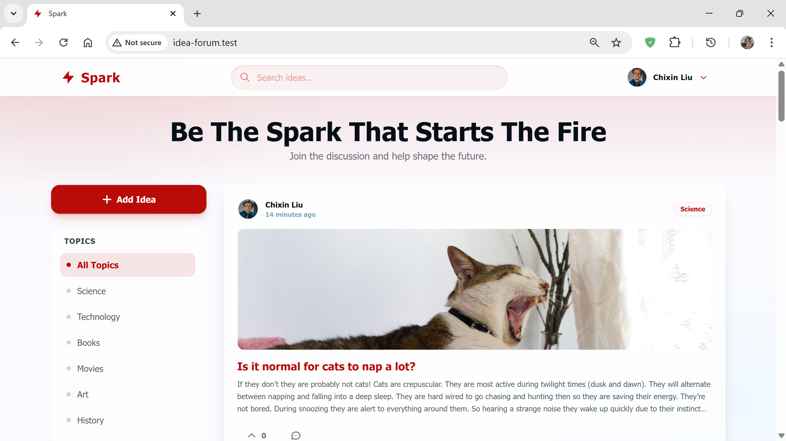

Capstone Project: # Idea-Forum

*Spark

    Spark is a modern, community-driven idea forum where innovation meets discussion. 
    provides a platform for users to share their concepts, vote on the best ideas, 
    and engage in meaningful discussions across various topics like Science, Technology, and Art.

Designed with a premium Red Glass (Glassmorphism) aesthetic, Spark offers a seamless and visually striking user experience.

## 📸 Preview of Spark

Feature Overview of Spark:

  - Idea Management: Users can submit, edit, and delete ideas.
  - Rich Media: Support for uploading images to ideas to make them stand out.
  - Voting System: Community-driven upvoting system to highlight the best ideas.
  - Dynamic Topics: Filter ideas by topics (e.g., Science, Books, Tech).
  - Admin Feature: Admins can create new topics dynamically from the sidebar.
  - Discussion: Robust commenting system for every idea.
  - User Profiles: Custom profile settings with avatar/profile picture uploads.
  - Global Search: Integrated search bar in the header to find ideas instantly.
  - Modern UI: Custom Brick Ember & Yale Blue color palette with a liquid glass interface.
  - Responsive: Fully optimized for desktop and mobile devices.

Technologies Used for creating Spark:

    Backend: 
    - Laravel (PHP Framework) for robust backend functionality
    - Livewire for dynamic components
    -SQLite for lightweight database management

    Frontend: 
    - Tailwind CSS for utility-first styling
    - Alpine.js for interactivity
    - Blade Templates for server-side rendering

    Here is the plain text version of the FAQ section you can add to the bottom of your README file.

FAQs for Spark:

1. How is the pagination working? 
-> Spark uses Laravel Livewire's built-in pagination system. By using the "WithPagination" trait in the Livewire component, 
our application can switch pages asynchronously without refreshing the entire browser window, providing a smooth user experience.

->Its located in "app/Livewire/IdeasIndex.php". We import the "WithPagination" trait at the top of the class, 
and inside the "render()" method, the database query ends with "->paginate(10)".

3. How does the real-time search and filtering work? 
-> We use Livewire's data binding. In "app/Livewire/IdeasIndex.php", there are public properties for "$search" and "$statusFilter". 
When a user types in the search bar or clicks a topic, Livewire automatically updates these variables. The "render()" method then runs
a new database query using Laravel's "when()" method to filter results instantly without a full page reload.

4. How are images stored and displayed? 
-> Images are uploaded using Livewire's "WithFileUploads" trait.
-> Storage: When a user uploads a photo, it is saved to the "storage/app/public" directory via the "store()" method in the Livewire component.
-> Display: We use the "php artisan storage:link" command to make these files accessible to the browser. 
-> In the Blade views, we use the "Storage::url($path)" helper to generate the correct HTML link for the image tag.
            
5. How is the Glassy styling implemented? 
-> The design relies on Tailwind CSS utility classes combined with custom CSS for the blur effect.
-> The Blur: We use "backdrop-blur-md" or "backdrop-blur-xl" to blur the background behind the element.
-> The Transparency: Background colors use opacity (e.g., "bg-white/70" or "bg-[#B80C09]/90") to let the background elements show through.
-> The Depth: We place fixed, colorful "blobs" in the main layout file ("app.blade.php") with "z-index: 0" so they sit behind the glass cards.
    
6. How are permissions handled (e.g., Edit/Delete)? 
-> We use Laravel's Authorization Policies.
-> Logic: In "app/Policies/IdeaPolicy.php", we define rules that check if the logged-in user's ID matches the idea's "user_id".
-> Frontend: In the Blade views, we wrap the Edit and Delete buttons in "@can('update', $idea)" directives. 
             This ensures buttons are only rendered for the creator of the post.

-> Admin: For topic creation, we perform a strict check against the admin's email address directly in the component.

Installation & Setup Instructions for Spark:

   Follow these steps to set up the project locally.

        1. Clone the Repository git clone https://github.com/yourusername/spark.git cd spark
        2. Install Dependencies composer install npm install
        3. Environment Setup Copy the example environment file and generate the application key. cp .env.example .env php artisan key:generate
        4. Database Setup Important: This project uses custom seeders for Topics and Admin accounts. Run the following command to create the database structure and populate it with default data. php artisan migrate:fresh --seed
        5. Link Storage To ensure profile photos and idea images load correctly, create a symbolic link: php artisan storage:link
        6. Run the Application Compile the assets and start the local server. npm run build php artisan serve
        7. Visit http://localhost:8000

Default Accounts
    The database seeder creates a default Admin Account with special privileges (like creating new topics).

Admin Account:
    Email: kunjandangal@gmail.com 
    Password: password

Note: You can also register a new account to test standard user features.

Authors:

  - Kunjan Dangal
  - Lav Patel

License:

  - This project is open-sourced software licensed under the MIT license.
